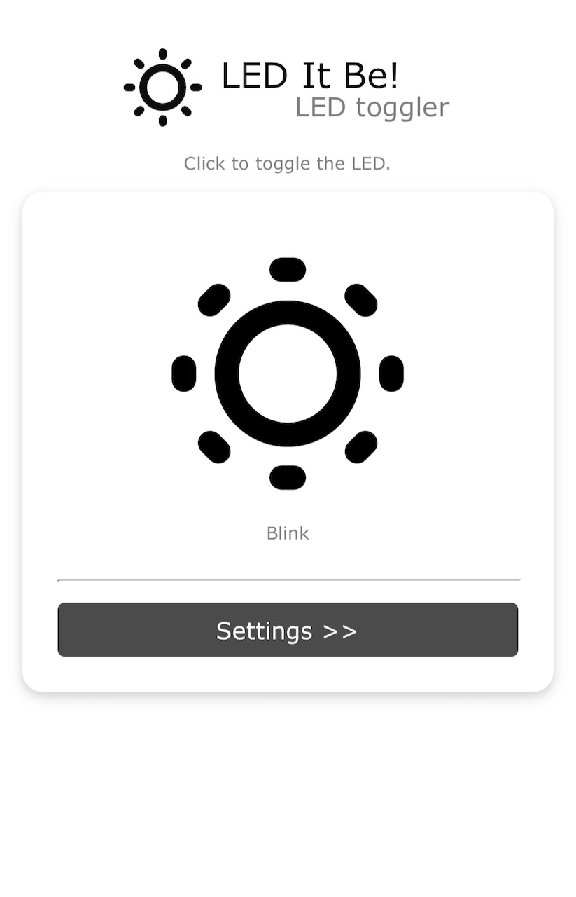
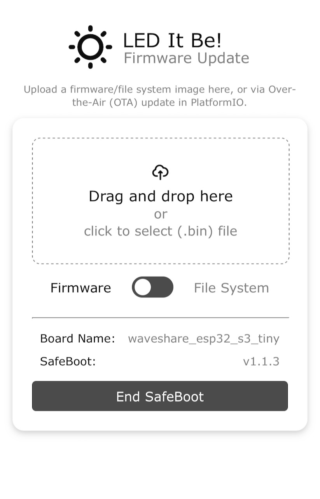
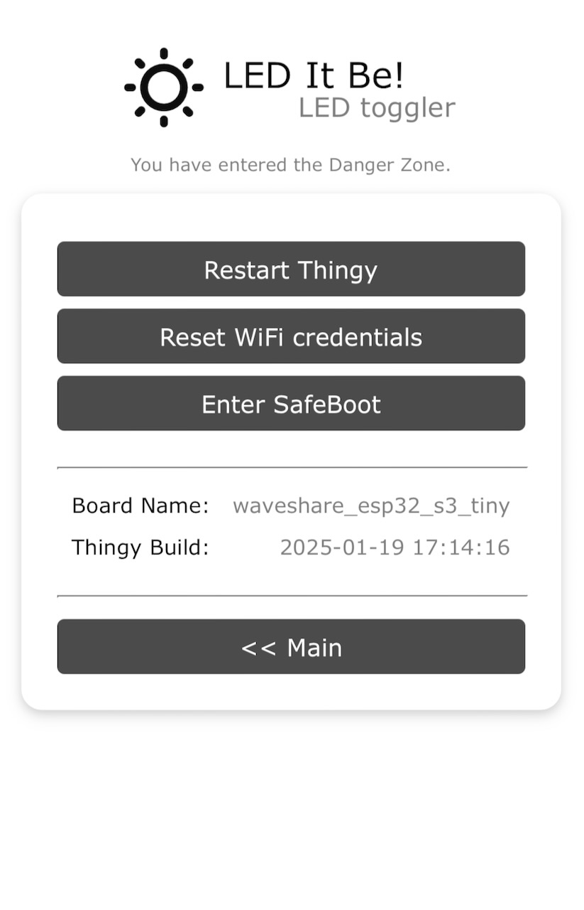

# LED it be!

An overcomplicated project to control the on-board LED of the [Waveshare ESP32-S3-Tiny board](https://www.waveshare.com/wiki/ESP32-S3-Tiny).



## Why do I need it?

Not at all. It's intended as a template for future projects.

## How is it made?

This project is implemented using [PlatformIO](https://platformio.org/) with the arduino-3 platform from the (p)eople (i)nitiated (o)ptimized (arduino) ([pioarduino](https://github.com/pioarduino/platform-espressif32/)). For my convenience, OTA-programming is enabled by including the [ArduinoOTA](https://github.com/espressif/arduino-esp32)-library from Espressif Systems' Arduino ESP32 project.
Firmware updates and ArduinoOTA is enabled with a small safeboot partition (640KB). The main app can span over ~3MB. To trigger a restart into this partion, just call `http://ledthingy.local/safeboot` or hit the SafeBoot-button in the Settings-page. After a few seconds the OTA-Website shows up.



A little quirky, but the safeboot-partition is tapping the preferences of the main app (more specifically: that of espconnect) to connect to your WiFi, or will create a softAP (in this case you might even upload new firmware from the captive portal after connecting to it - tested only on mac though).
Also, the logo and board information are provided to the safeboot-partition via preferences (see the `main.cpp`).

When using Over-the-Air (OTA) updating from PlatformIO, the safeboot-mode will be activated via a script when you hit Upload (see `extra_scripts = tools/safeboot_activate.py`).  

* The webserver is powered by [ESPAsyncWebServer](https://github.com/mathieucarbou/ESPAsyncWebServer) - GNU Lesser General Public License v3.0
* The network manager is [MycilaESPConnect](https://github.com/mathieucarbou/MycilaESPConnect) - GNU General Public License v3.0
* The task manager is [TaskScheduler](https://github.com/arkhipenko/TaskScheduler) - BSD 3-Clause "New" or "Revised" License
* The safeboot-partition contains ArduinoOTA and OTA-Update - the scripts factory.py and safeboot.py from [MycilaSafeBoot](https://github.com/mathieucarbou/MycilaSafeBoot) fall under MIT license. [ArduinoOTA](https://github.com/espressif/arduino-esp32/tree/master/libraries/ArduinoOTA) and [Update](https://github.com/espressif/arduino-esp32/tree/master/libraries/Update) are from [Espressif Systems' Arduino ESP32 core library](https://github.com/espressif/arduino-esp32/tree/master/libraries). Both are Apache-2.0
* The icons from the [Mono Interface Icons Collection](https://www.svgrepo.com/collection/mono-interface-icons/) are public domain

## How does it work?

Flash the firmaware to your board. Connect to the new Access-Point (LEDPortal) and connect the board to your trusted WiFi. Afterwards you can just open `http://ledthingy.local` to see the (minimalistic, at most...) Website.

The state of the onboard LED is toggled (off/on/blinking) when clicking the image area.
When your board feateures an RGB-LED, then random colors are used.

Even though setting the LED state is extremely fast, I sprinkled in some preemptive tasks ([FreeRTOS](https://www.freertos.org/)) that are hidden in cooperative tasks ([TaskScheduler](https://github.com/arkhipenko/TaskScheduler)) and thus use the same simple interface for signaling their status.
Overkill fur sure, but see: [Why do I need it?](#why-do-i-need-it) 

### How to flash the firmware?

Flashing the board for the first time (with the factory.bin, which is including SafeBoot, the application and the file system image) is done via esptool within PlatformIO to the USB-CDC of the board. 
Remember, when using a board with USB-CDC, you need to press both buttons, release the "0"-button first, then the "RST"-button (this sequence will enable the USB-CDC). 
Subsequently, you can just flash it without button juggling or simply flash it OTA (set `upload_protocol = espota` and upload_port = `ledthingy.local`, and also add `extra_scripts = tools/safeboot_activate.py` in your platformio.ini). 

Additionally, you can use SafeBoot (hit the SafeBoot-button in Settings) to upload firmware and file system images.



When flashing the factory.bin (e.g. after updating SafeBoot) you'll always have to to the button juggling.

## How can I modify it to be of real use?

Just fork the git!
Some points that I would have liked to know earlier:

* The favicon was prepared using [Favicon generator. For real](https://realfavicongenerator.net/). 
* See the `WebServerTask.cpp` on how to serve the logo for ESPConnect.
* The favicon-images are taken from the data-folder, compressed and linked into the firmware image. When you want to find out how to use them, have a look in the `firmware.map` (in `.pio/build/[your-env]`).
* This project is using [TaskScheduler](https://github.com/arkhipenko/TaskScheduler) for cooperative multitasking. The `main.cpp` seems rather empty, everything that's interesting is happening in the individual tasks.
* Creating svgs with Inkscape leaves a lot of clutter in the file, [SVGminify.com](https://www.svgminify.com/) helps
* [jsfiddle](https://jsfiddle.net/) in extremely helpful in testing the websites. See one of the test fiddles [here](https://jsfiddle.net/9wr62y3u/28/)
* You can burn your time easily when trying to come up with solutions for marginal problems...

## Using Custom Boards

To get a board PlatformIO running with a board thats not already covered by their [list of boards](https://docs.platformio.org/en/stable/boards/index.html), add a folder `boards` to your project, which is taking precedence over the built-in and thus could also be used to modify existing board manifests (.json), and add your manifest file (here: `waveshare_esp_s3_tiny.json`). 

As this board is unknown to the [Arduino core for the ESP32](https://github.com/espressif/arduino-esp32) no `pins_arduino.h` will be found. 
Add a folder `variants/waveshare_esp32_s3_tiny` to your project and add a `pins_arduino.h` file matching the board. Make sure to point to this variants-folder in the board manifest:

```json
"variant": "waveshare_esp32_s3_tiny",
"variants_dir": "variants"
```  

and add the environment to the `platformio.ini`:

```ini
[env:esp32_s3_tiny]
board = waveshare_esp32_s3_tiny
```

## Future work

Mental notes to myself: 

* Safeboot is rather independent from the main app now (just needs some preferences set up). Consider to make it a project on it's own.
* Come up with even more stupid names for projects!
* Use svelte instead of hacking the html-files manually
* Reduce xternal depencies
* Add webserial matching OTA
* Make screenshots smaller
